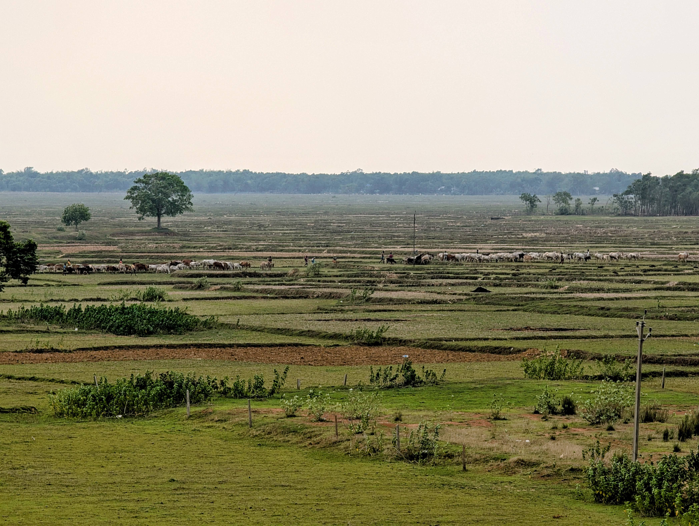
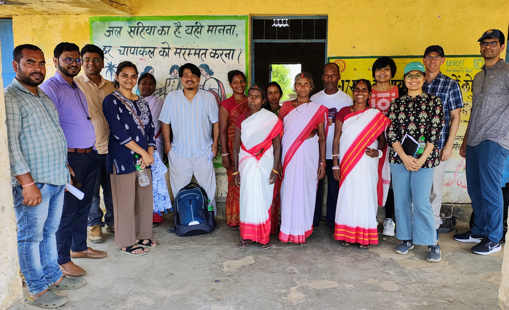
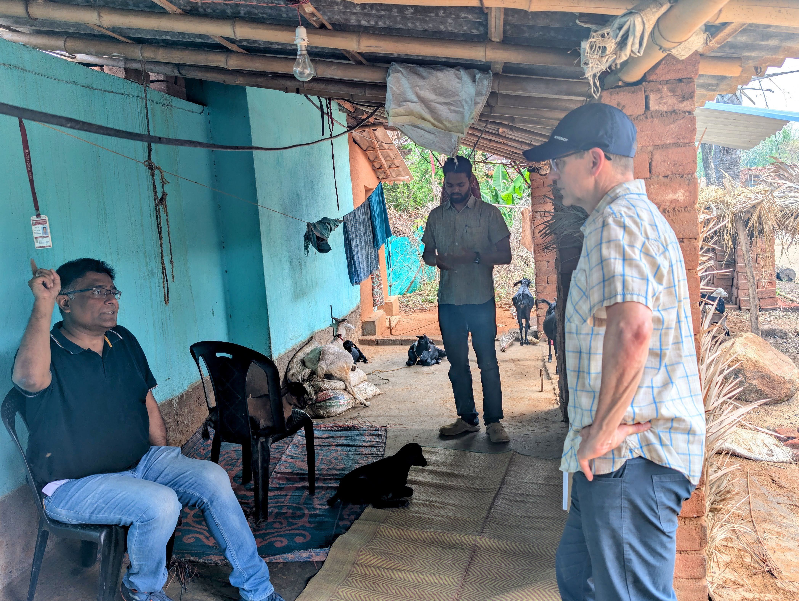
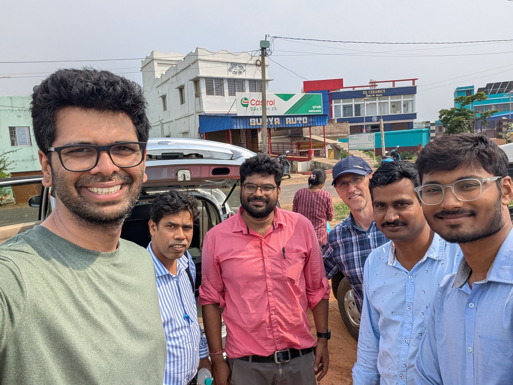

<!-- Top gallery — uses your actual files in /gallery/ -->

  
  
  
  
  

Smallholder farming systems, which underpin over a third of global food production, face unprecedented pressures from climate change. In response, governments and development organizations increasingly promote climate-smart agriculture as a key adaptation strategy. Yet prevailing approaches often equate adoption with success, overlooking the behavioral, structural, and temporal dynamics that determine who can sustain adaptations over time. This narrow focus risks reinforcing rather than reducing livelihood inequalities. 

This work reframes adaptation as an iterative decision process shaped by unequal capacities and social hierarchies. Drawing on field research and spatial agent-based models, we examine how individual and broader-scale capacities interact to shape adaptation trajectories of marginalized households, and how they reinforce or mitigate long-standing inequalities.

<h3 class="h3-with-icon">
  
    <!-- Twin question marks, centered, no clipping -->
    <svg class="qmarks" viewBox="0 0 24 24" aria-hidden="true" focusable="false">
      <!-- Left ? -->
      <g transform="translate(-5,0)">
        <path d="M9 9a3 3 0 1 1 4.6 2.57c-.98.58-1.6 1.25-1.6 2.18v.4"/>
        <path d="M12 18h0.01"/>
      </g>
      <!-- Right ? -->
      <g transform="translate(5,0)">
        <path d="M9 9a3 3 0 1 1 4.6 2.57c-.98.58-1.6 1.25-1.6 2.18v.4"/>
        <path d="M12 18h0.01"/>
      </g>
    </svg>
  
  Research Questions
</h3>

- **Adaptive capacities and interactions.** How do individual- and community-level capacities, and their interactions, shape not only the adoption but the sustained adoption of climate-smart technologies and practices?
- **Feedbacks and dynamics.** How do feedbacks between social, behavioral, and environmental dynamics influence long-term livelihood outcomes, including resilience and inequality?
- **Scale.** How do adaptation decisions at the household level scale across production systems, from subsistence-oriented to more commercial farming, and what do these dynamics reveal about structural inequalities and sustainability?
- **Inequality and resilience.** How do differentiated adoption trajectories between dominant and marginalized groups shape patterns of livelihood inequality and system-level resilience over time?

<h3>Core methods</h3>

  

    Econometrics
    Behavioral modeling
    Spatial agent-based modeling
  

