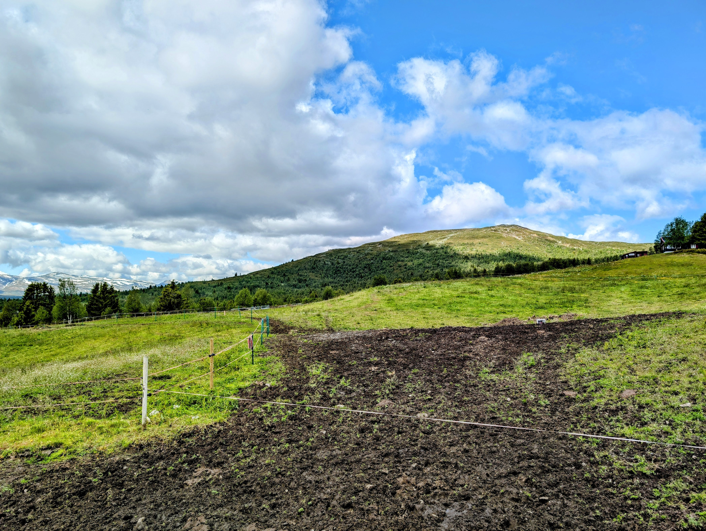
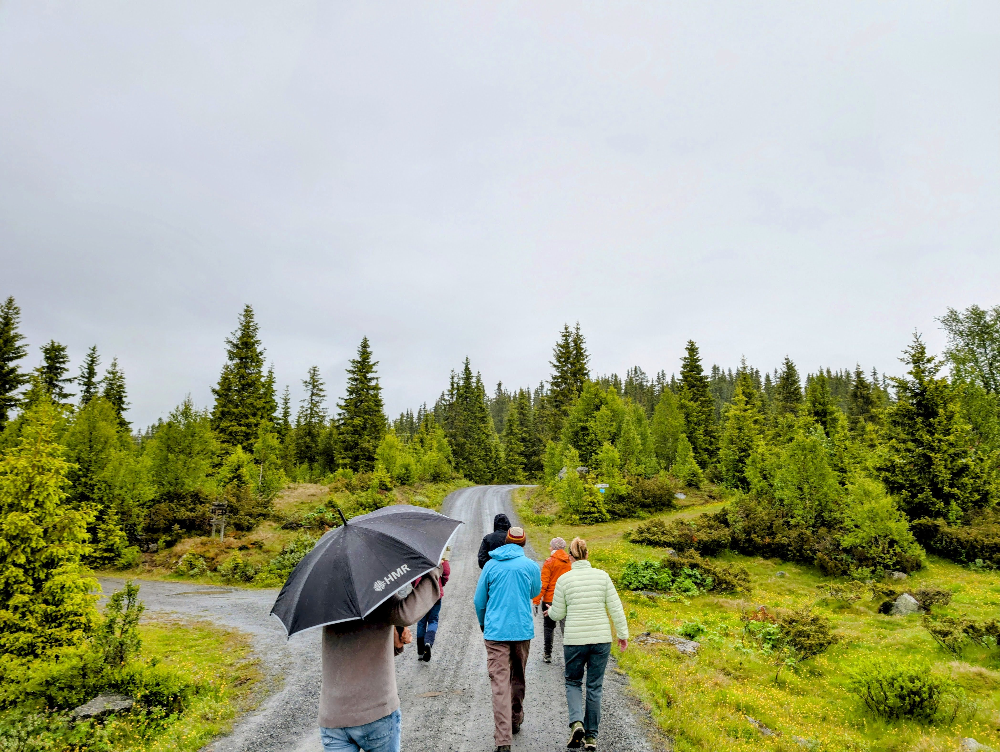

<!-- Top gallery — uses your actual files in /gallery/ -->

  
  
  
  
  

Transhumant pastoral systems in France, Norway, and Spain sustain landscapes, livelihoods, and cultural heritage that have persisted for centuries. Yet these systems now face novel climate hazards, from droughts and wildfire in Spain to shorter snow seasons in Norway, compounded by demographic change, economic pressures, and the erosion of traditional ecological knowledge.

This work investigates how institutions and governance regimes evolve in response to socio-environmental stressors, and how these institutional dynamics scale from local to regional governance. Drawing on archival documents, and Delphi surveys of policy experts, we analyze how institutions and governance regimes shape adaptive capacity in these cultural heritage landscapes. 

<h3 class="h3-with-icon">
  
    <!-- Twin question marks, centered, no clipping -->
    <svg class="qmarks" viewBox="0 0 24 24" aria-hidden="true" focusable="false">
      <!-- Left ? -->
      <g transform="translate(-5,0)">
        <path d="M9 9a3 3 0 1 1 4.6 2.57c-.98.58-1.6 1.25-1.6 2.18v.4"/>
        <path d="M12 18h0.01"/>
      </g>
      <!-- Right ? -->
      <g transform="translate(5,0)">
        <path d="M9 9a3 3 0 1 1 4.6 2.57c-.98.58-1.6 1.25-1.6 2.18v.4"/>
        <path d="M12 18h0.01"/>
      </g>
    </svg>
  
  Research Questions
</h3>

- **Institutional evolution.** How have rules, norms, and community institutions evolved in response to environmental and social shocks, and what do these trajectories reveal about adaptive capacity?
- **Scale and governance mismatches.** How do national and regional policy priorities align with the lived challenges of farm- and community-level adaptation, and what do these cross-scale mismatches reveal about sustainability in pastoral systems?
- **Comparative institutions.** What do institutional differences across France, Norway, and Spain reveal about the diverse pathways of adaptation and resilience in pastoral systems?

<h3>Core methods</h3>

  

    Computational text analysis (LLMs)
    Dynamical systems modeling
    Configurational comparative methods
  

